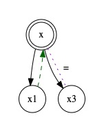
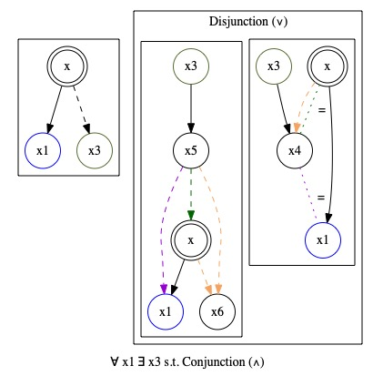

# Automated Modal Correspondence
## General
This project has been implemented for a Bachelor's Thesis at the University of Amsterdam. It is an implementation of the Sahlqvist-van Benthem Algorithm, which computes local first-order correspondents of modal formulas that have certain syntactic characteristics. To engage with this product, one needs to have Haskell as well as a compiler such as GHCi installed. Use the 'stack ghci' command in the project folder to load all files.

## Input
The user interactions occur in the Main.hs file. When all files are loaded in the compliler, one can access this by entering 'main' in the terminal. At this point, the user can enter a modal formula as input.

The following conventions are used to enter modal formulas (commas signify different options):

Actual | Input
--- | ---
Proposition | p, q, r
Top | Top
Bot | Bot
Negation | ~, Not, not
Conjunction | &
Disjunction | \|
Implication | ->
Bi-implication | iff
Box | []
Diamond | <>
Brackets | (, )

Use brackets to ensure the modal input formula is parsed as intended. Using tokens outside of this table will result in lexing errors. Incorrect modal syntax will result in a parsing error. 

Provided a correct modal formula as input. The program will first return that formula such that the user is made aware of possibly ambiguous parses.

## Output
For any modal formula, the program outputs the following:
- Whether the formula is **Sahlqvist**
- Whether the formula is **uniform**
- If _possible_, a **first-order correspondent**
    - Otherwise a notification that no correspondent can be found.
    - If _possible_, a **visualization** of the local frame property

If the formula is Sahlqvist or uniform, a first-order correspondent will always be computed. If a first-order correspondent is computable, a visualization is given provided some conditions on the complexity of the frame property.

### Interpreting the Visualizations
To signify the _locality_ of the frame property, the world at which the propety is considered is marked by a double cirlce. The relation that is implied is dashed. For example, this is the visualization of the **reflexivity** property. (Modal input (e.g.): p -> <> p)
>  

When the correspondent is an implication, the antecedent has filled arrows, while the consequent is dashed. For example, consider the **Church Rosser** property. (<>[]p -> []<>p) This has a conjunction of relations in the antecedent and a conjucntion of relations in the consequent. For such conjunctions, we get multiple black arrows.
> 

It may be that the correspondent implies a disjunction of certain relations. For example, consider the correspondent of the following modal input **(<>[]p & <>p) -> p)**. We interpret it as follows: If world _w_ has two outgoing _R_ arrows to worlds _w1_ and _w3_ (which need not be different), then it must be that _w1Rw_ or _w3 = w_. The latter just implies one of the outgoing arrows is reflexive. Note that the equivalence of two worlds is signified by a undirectional line labeled '=' between the two.
> 

One more edge property to visualize is the absence of the _R_ relation. This is signified by a red arrow with a boxed arrowhead and a label x. For example, consider the **blindness** property. ([]p)
> 

An example of a more complex visualization is that of the modal input formula **(p & <>p & []p) -> <>([]p | []<>p)**.
> 

In this visualization, _w3_ is marked in each of the clusters to signify it is the same world every time. We see two clusters in the outer conjunction, both of them must be true in the frame. The rightmost of those clusters is itself a disjunction of two clusters, so either of them must be true. Moreover, in each of those disjunction clusters a disjunction is implied, so one of the three colors in any of the two disjunction clusters must be the case for the outer disjunction to hold.

For clarity, we have chosen to limit the colors of implied disjunctions by 3. So, a formula like (p & <>p & []p **& <><>p**) -> <>([]p | []<>p), will not get a visualization. The user is notified that it has too many implied disjuncts.

A visualization is also not generated when there is too much nesting of clusters. In the picture above we have a conjunction cluster over a disjunction cluster. So, for a formula like ((p & <>p & []p) -> <>([]p | []<>p)) **| (q -> <>q)**, which would result in a first order correspondent that is a disjunction over a conjunction over a disjunction, no visualization is provided. We limit the nesting of subclusters by up to 2 layers.